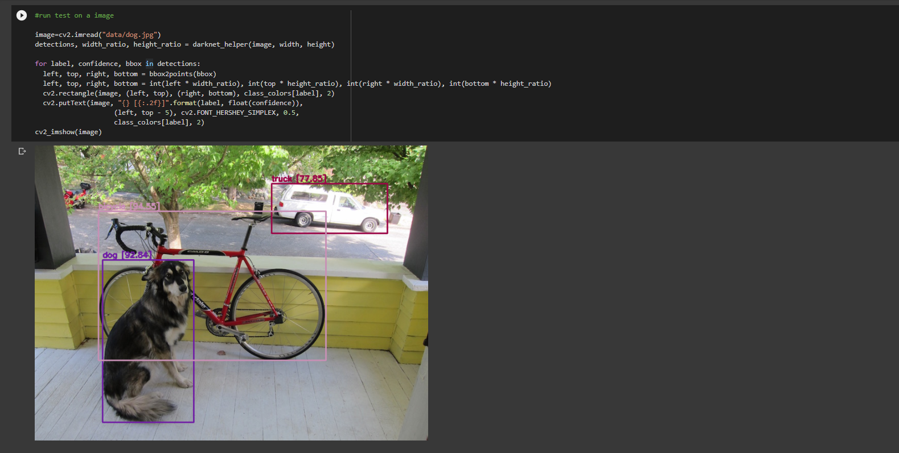

# webcam-object-detection

Detect objects with the use of webcam video/image with Google Colab. This project utilizes the YOLOv4 architecture and provides real-time detection. Try to open and explore the notebook by using the link above!

## Deep Learning Architecture Used 🔮

**Yolo** (You Only Look Once) is one of the fastest objection detection algorithms. It can provide object detections in real-time. The demo uses this on webcam images and video with high relative accuracy and speed. 

With YOLO, a single CNN simultaneously predicts multiple bounding boxes and class probabilities for those boxes. YOLO trains on full images and directly optimizes detection performance.

## Darknet ❓
[Darknet](https://github.com/AlexeyAB/darknet) is mainly used for Object Detection, and have different architecture, features than other deep learning frameworks like Pytorch and Tensorflow. It is faster than many other Nerual Network architectures and approaches like FasterRCNN etc. 

YOLO is based on darknet. Darknet is an open source neural network framework written in C and CUDA. It is written on C meaning it can provide faster performance and higher accuracy. 

## Specifications 💻 
* **Model: Yolov4**
* **Weights Used: yolov4-csp.weights** 

This is uses scaled yolov4 weights because it provides fast detection speed and reliable accuracy. Note: the weights were pre trained on the [MS COCO dataset](https://cocodataset.org/#home).
    

## Snaptshot and Demo 📷

Perform object detection on images by uploading the photo to colab

Real-time Webcam Object Detection 

